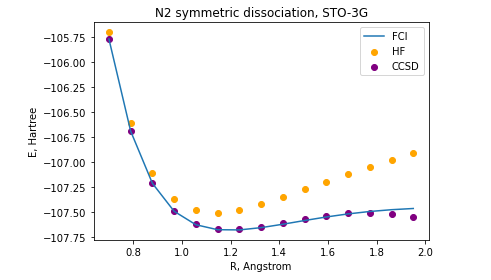

## Project 2: VQE

In this project we have explored the Variational Quantum Eigensolver (VQE) for constructing potential energy surfaces for small molecules: LiH, H4, and N2.

A very brief introduction to the main ideas behind the VQE are 
[here.](https://github.com/CDL-Quantum/CohortProject_2020/blob/master/CDL_2020_docs.pdf)

Assignments can be found [here.](https://github.com/CDL-Quantum/CohortProject_2020/blob/master/Project_2_VQE_Molecules/Project_2_LandingPage.pdf)

## Tasks and Challenges

### Step #1: Generating PES using classical methods.

In this part, we implemented three most commly used methods for extraction of the molecule structure: HF, CCSD, and FCI. All three methods scale polynomially with the system size  but fail to deliver chemical accuracy along PESs. We were, however, able to estimate approximately ground state Bound Energy.  

### Step #2: Generating the qubit Hamiltonian.

To proceed with VQE, we generated the qubit Hamiltonian. We first generated the electronic Hamiltonian in the second quantized form and then mapped it into a qubit form using two of the most known fermion-to-qubit transformations: Jordan-Wigner and Bravyi-Kitaev. Both mappings give consistant results in our simulations.

### Step #3: Unitary Transformation.

We used two types of unitary transformations for generating quantum gates: QCC and UCC. One issue we faced while working on this part is a need of active space minimization. For instance, the Hamiltonian of LiH molecule consists of 631 Hamiltonian terms, which is extremely large. Our approach was to initialize the LiH molecule with an active space containing the second A1 orbitals (meaning the first 0A1 orbital is frozen) and the B1 orbital. This active space adjustment allowed us to run calculations faster with satisfying results. 

### Step #4: Hamiltonian Measurements.

To obtain the expectation value of the qubit Hamiltonian, it needs to be measured at the end of the VQE circuit. Since current quantum hardware is limited to single-qubit projective measurement, only terms commuting within individual qubit's subspace can be measured together.

### Step #5: Use of Quantum Hardware

To carry out the VQE algorithm on the actual quantum hardware, wee have to present unitary transformations as a sequence of gates, i.e. circuit. We executed the quantum circuit for thr LiH molecule on the IBM Q hardware.

### Further Challenges.

We calculated excited electronic states for LiH molecule using the shift energy technique, for instance, the ground state energy was shifted to the first excited state.

## Business Application

Check out our Business Application [here.](https://github.com/Anand270294/CohortProject_2020/blob/master/Project_2_VQE_Molecules/BusinessApplication.md)

## Our Team Members

Find out about team members [here.](https://github.com/Anand270294/CohortProject_2020/blob/master/Project_2_VQE_Molecules/Contributions.md)

